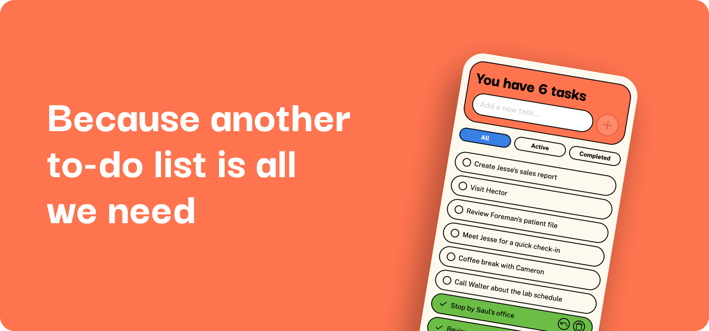

# Neo Todo



Oh great, just what we all need — another to-do list. Because if we don’t write it down, did we even avoid doing it?

## Features

- ✅ Unlimited To-Dos
- 🧘 “Mark as Done” Button
- 🗂️ Filter by All / Incomplete / Completed

## Tech Stack

- React
- TypeScript
- Vite
- Tailwind CSS

## Getting Started

1. Clone the repository
2. Install dependencies:
   ```bash
   pnpm install
   ```
3. Start the development server:
   ```bash
   pnpm run dev
   ```
